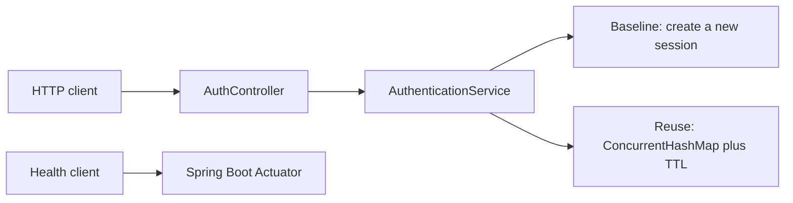

# Java Backend Performance Lab

A public, reproducible lab for measuring Java backend performance trade-offs. The project starts with authentication-session reuse and will later add database query optimization and repeatable load testing.

## Current scope

Phase 1 intentionally contains only:

- Java 21 and Spring Boot 4.1
- a Spring Boot Actuator health endpoint
- a baseline authentication path that creates a new session for every request
- an in-memory session-reuse path with a configurable TTL
- integration tests that exercise the application through a real HTTP port
- the Maven Wrapper for repeatable local builds

PostgreSQL, JPA, Docker, CI, load generators, and benchmark results are not implemented yet. They are listed only as future milestones.

## Architecture



The two authentication paths share the same session creation logic:

- `POST /api/v1/auth/baseline` always creates a fresh session.
- `POST /api/v1/auth/session-reuse` reuses the active session for the same `clientId` until its TTL expires.

This is a performance-lab skeleton, not a production identity provider. It accepts no passwords and performs no real credential verification.

## Prerequisites

- JDK 21
- No global Maven installation is required.
- Docker is not required for Phase 1.

## Quick start

On Windows PowerShell:

```powershell
.\mvnw.cmd clean verify
.\mvnw.cmd spring-boot:run
```

On a managed Windows network, Maven may report a `PKIX path building failed` error when the network's trusted certificate exists only in the Windows certificate store. Use the Windows trust store without disabling certificate verification:

```powershell
$env:MAVEN_OPTS = '-Djavax.net.ssl.trustStore=NONE -Djavax.net.ssl.trustStoreType=Windows-ROOT'
.\mvnw.cmd clean verify
```

On macOS or Linux:

```bash
./mvnw clean verify
./mvnw spring-boot:run
```

Check health:

```powershell
Invoke-RestMethod http://localhost:8080/actuator/health
```

Compare the two authentication paths:

```powershell
$body = '{"clientId":"demo-client"}'

Invoke-RestMethod -Method Post `
  -Uri http://localhost:8080/api/v1/auth/baseline `
  -ContentType application/json `
  -Body $body

Invoke-RestMethod -Method Post `
  -Uri http://localhost:8080/api/v1/auth/session-reuse `
  -ContentType application/json `
  -Body $body
```

The default session TTL is 30 seconds. Override it with a Spring property or environment variable:

```powershell
$env:LAB_AUTH_SESSION_TTL = '2m'
.\mvnw.cmd spring-boot:run
```

## Milestones

| Phase | Deliverable | Verification gate |
| --- | --- | --- |
| 1 | Health endpoint and minimal baseline/session-reuse API | HTTP integration tests and packaged JAR build |
| 2 | PostgreSQL, JPA, deterministic data generator, and indexed query cases | Repeatable data load plus captured `EXPLAIN ANALYZE` plans |
| 3 | k6 or Gatling scenarios for baseline versus reuse | Versioned scripts, warm-up policy, raw results, and independent reruns |
| 4 | Docker Compose and GitHub Actions | Clean container startup and passing CI from a fresh checkout |
| 5 | Published benchmark report | Hardware, software, dataset, method, results, and limitations documented together |

## Benchmark policy

No benchmark claim will be published until the project can reproduce it from its own code, generated data, and versioned test scripts. Results will report the test environment, warm-up, concurrency, duration, error rate, percentiles, and known limitations.

## Local verification

Phase 1 was verified on 2026-08-07 with Microsoft OpenJDK 21.0.12, Maven Wrapper 3.9.16, and Spring Boot 4.1.0:

```text
Tests run: 4, Failures: 0, Errors: 0, Skipped: 0
BUILD SUCCESS
```

The packaged JAR was also started separately. Its health endpoint returned `UP`, baseline calls returned different session IDs, and the second reuse call returned the first session ID with `reused=true`. These are functional checks, not performance benchmark results.

## Authenticity and confidentiality

This project is independently designed and implemented as a portfolio lab. It does not contain or derive from any employer or customer source code, data, configuration, proprietary architecture, or confidential material. Professional experience may inspire the problem selection, but only measurements produced by this repository will be reported as project benchmark results.

## Current limitations

- Session state is process-local and is lost on restart.
- The session store is not suitable for multiple application instances.
- Expired entries are replaced only when the same client calls again; there is no background cleanup yet.
- Authentication is represented by session creation only; there is no credential provider yet.
- No performance conclusion can be drawn from Phase 1.
