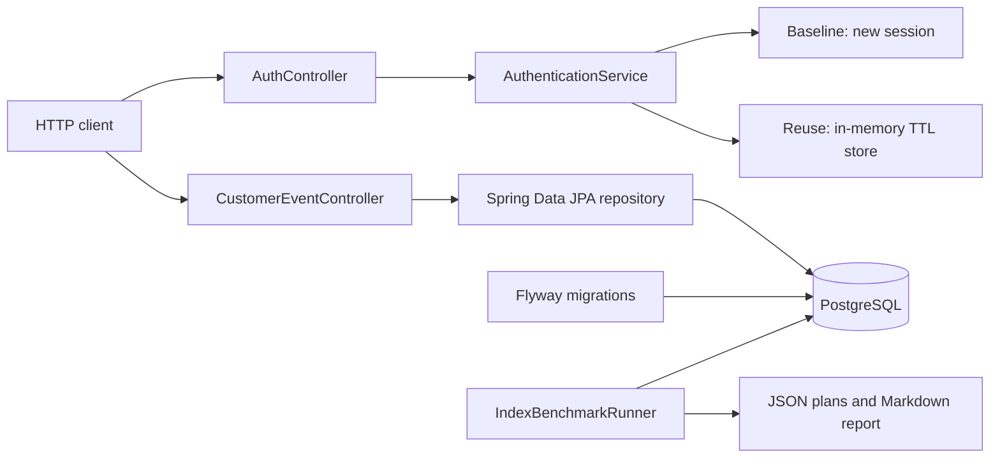

# Java Backend Performance Lab

A public, reproducible lab for measuring Java backend performance trade-offs. The completed phases cover authentication-session reuse and PostgreSQL composite-index optimization with repository-generated evidence.

## Implemented scope

- Java 21 and Spring Boot 4.1
- Spring Boot Actuator health endpoint
- baseline authentication that creates a new session for every request
- in-memory session reuse with a configurable TTL
- PostgreSQL 18, Spring Data JPA, Hibernate schema validation, and Flyway migrations
- deterministic large-dataset generation with PostgreSQL `generate_series`
- automated before/after `EXPLAIN (ANALYZE, BUFFERS, FORMAT JSON)` measurements
- HTTP integration tests against a real PostgreSQL database
- Maven Wrapper for repeatable builds

Docker Compose, GitHub Actions, concurrent load tests, and production-capacity claims are not implemented yet.

## Architecture



## API paths

### Authentication comparison

- `POST /api/v1/auth/baseline` always creates a fresh session.
- `POST /api/v1/auth/session-reuse` reuses the active session for the same `clientId` until its TTL expires.

This is a performance-lab skeleton, not a production identity provider. It accepts no passwords and performs no real credential verification.

### Indexed event lookup

`GET /api/v1/events/recent` reads through Spring Data JPA using this access pattern:

```sql
SELECT id, tenant_id, customer_id, event_type, occurred_at, payload
FROM customer_events
WHERE tenant_id = :tenantId
  AND event_type = :eventType
  AND occurred_at >= :from
ORDER BY occurred_at DESC
LIMIT :limit;
```

Flyway creates the matching index:

```sql
CREATE INDEX idx_customer_events_tenant_type_occurred_at
    ON customer_events (tenant_id, event_type, occurred_at DESC);
```

## Prerequisites

- JDK 21
- PostgreSQL 18
- `psql` for initial database creation
- No global Maven installation is required.

Docker is not required for the completed phases.

## Database setup

Choose local development passwords and run the versioned setup script as a PostgreSQL administrator.

Windows PowerShell:

```powershell
$env:LAB_DB_PASSWORD = '<choose-a-local-password>'
$env:PGPASSWORD = '<your-postgres-admin-password>'

psql -U postgres -h localhost `
  -v "lab_password=$env:LAB_DB_PASSWORD" `
  -f .\scripts\setup-database.sql

Remove-Item Env:PGPASSWORD
```

macOS or Linux:

```bash
export LAB_DB_PASSWORD='<choose-a-local-password>'
export PGPASSWORD='<your-postgres-admin-password>'

psql -U postgres -h localhost \
  -v "lab_password=$LAB_DB_PASSWORD" \
  -f ./scripts/setup-database.sql

unset PGPASSWORD
```

The application supports these environment variables:

| Variable | Default |
| --- | --- |
| `LAB_DB_URL` | `jdbc:postgresql://localhost:5432/performance_lab` |
| `LAB_DB_USERNAME` | `performance_lab` |
| `LAB_DB_PASSWORD` | no default |
| `LAB_AUTH_SESSION_TTL` | `30s` |

## Build and run

Windows PowerShell:

```powershell
.\mvnw.cmd clean verify
.\mvnw.cmd spring-boot:run
```

macOS or Linux:

```bash
./mvnw clean verify
./mvnw spring-boot:run
```

On a managed Windows network, Maven may report `PKIX path building failed` when a trusted proxy certificate exists only in the Windows certificate store. This keeps certificate verification enabled while using that store:

```powershell
$env:MAVEN_OPTS = '-Djavax.net.ssl.trustStore=NONE -Djavax.net.ssl.trustStoreType=Windows-ROOT'
.\mvnw.cmd clean verify
```

Check health:

```powershell
Invoke-RestMethod http://localhost:8080/actuator/health
```

Exercise session reuse:

```powershell
$body = '{"clientId":"demo-client"}'

Invoke-RestMethod -Method Post `
  -Uri http://localhost:8080/api/v1/auth/session-reuse `
  -ContentType application/json `
  -Body $body
```

Query recent events after generating benchmark data:

```powershell
Invoke-RestMethod `
  'http://localhost:8080/api/v1/events/recent?tenantId=42&eventType=PURCHASE&from=2025-01-01T00:00:00Z&limit=100'
```

## Reproduce the PostgreSQL benchmark

The benchmark replaces the contents of `customer_events`. Do not point it at a shared or production database.

Windows PowerShell:

```powershell
$env:LAB_DB_PASSWORD = '<your-local-lab-password>'
.\scripts\run-benchmark.ps1 -Rows 1000000
```

macOS or Linux:

```bash
export LAB_DB_PASSWORD='<your-local-lab-password>'
export SPRING_PROFILES_ACTIVE=benchmark
export LAB_BENCHMARK_ROWS=1000000
./mvnw spring-boot:run
```

Configuration variables:

| Variable | Default |
| --- | ---: |
| `LAB_BENCHMARK_ROWS` | `1000000` |
| `LAB_BENCHMARK_WARMUP_RUNS` | `2` |
| `LAB_BENCHMARK_MEASURED_RUNS` | `5` |
| `LAB_BENCHMARK_OUTPUT_DIRECTORY` | `benchmarks/results/postgresql-18.4` |

The runner temporarily drops the lookup index for the baseline measurement and restores it in a `finally` block.

## Verified Phase 2 result

The committed [benchmark report](benchmarks/results/postgresql-18.4/README.md) and [raw JSON plans](benchmarks/results/postgresql-18.4/index-comparison.json) were generated by this repository on 2026-08-07.

| Dataset | Case | Plan | Median execution time |
| ---: | --- | --- | ---: |
| 1,000,000 rows | Before index | Sequential scan | 53.489 ms |
| 1,000,000 rows | After index | Index scan | 0.040 ms |

For this exact query, generated dataset, warm-cache method, and local machine, the median ratio was **1337.225x**. This is not a production throughput or capacity claim. Hardware, cache state, PostgreSQL settings, concurrency, storage, and data distribution can materially change the result.

## Verification

Phase 2 was verified with Microsoft OpenJDK 21.0.12, PostgreSQL 18.4, Maven Wrapper 3.9.16, Spring Boot 4.1.0, and Flyway 12.4.0:

```text
Tests run: 6, Failures: 0, Errors: 0, Skipped: 0
BUILD SUCCESS
```

The integration suite starts the application on a real HTTP port, validates Flyway and Hibernate startup, calls the PostgreSQL-backed JPA endpoint, and retains the Phase 1 health and session-behavior checks.

## Milestones

| Phase | Status | Deliverable | Verification gate |
| --- | --- | --- | --- |
| 1 | Complete | Health endpoint and baseline/session-reuse API | HTTP integration tests and packaged JAR |
| 2 | Complete | PostgreSQL, JPA, deterministic dataset, and indexed query | Real database tests plus saved `EXPLAIN ANALYZE` plans |
| 3 | Next | k6 or Gatling scenarios for baseline versus reuse | Versioned scripts, warm-up policy, raw results, and independent reruns |
| 4 | Planned | Docker Compose and GitHub Actions | Clean container startup and passing CI from a fresh checkout |
| 5 | Planned | Consolidated benchmark report | Environment, method, results, and limitations documented together |

## Authenticity and confidentiality

This project is independently designed and implemented as a portfolio lab. It does not contain or derive from any employer or customer source code, data, configuration, proprietary architecture, or confidential material. Professional experience may inspire the problem selection, but only measurements produced by this repository are reported as project results.

## Current limitations

- Session state is process-local and is lost on restart.
- The session store is not suitable for multiple application instances.
- Expired sessions have no background cleanup yet.
- Authentication represents session creation only; there is no credential provider.
- Database integration tests currently require a running local PostgreSQL instance.
- The database result is a single-machine query benchmark, not a concurrent load test.
