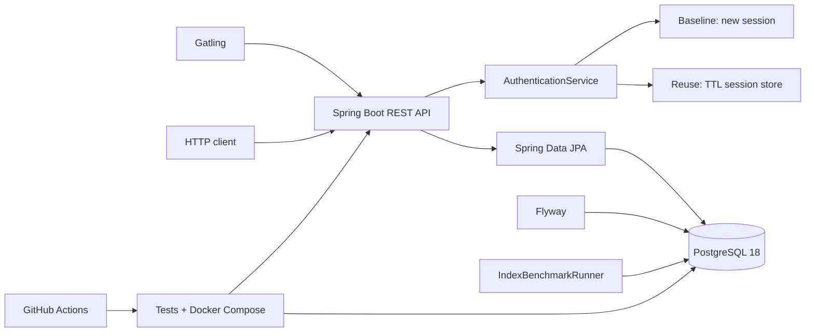

# Java Backend Performance Lab

[](https://github.com/kennyufish/java-backend-performance-lab/actions/workflows/ci.yml)

A reproducible Java backend portfolio project that measures two concrete optimization techniques: reusing active authentication sessions and matching a PostgreSQL composite index to a real query access pattern.

## Interactive demo

[Open the interactive demo](https://kennyufish.github.io/java-backend-performance-lab/) · [中文演示](https://kennyufish.github.io/java-backend-performance-lab/?lang=zh)

The standalone website in [`site/`](site/) animates session reuse and PostgreSQL indexing in English and Chinese. It runs without the Java backend. See [local preview and GitHub Pages publishing](docs/DEMO.md) to use it as this repository's website.

## Key results

| Experiment | Baseline | Optimized | Repository result |
| --- | ---: | ---: | ---: |
| Authentication mean response time | 34 ms | 6 ms | **5.667x ratio** |
| Authentication p95 response time | 37 ms | 14 ms | **2.643x ratio** |
| PostgreSQL median query time | 53.489 ms | 0.040 ms | **1337.225x ratio** |

These are local, repository-generated measurements under documented synthetic conditions. They are not production-capacity claims. See the complete [benchmark report](BENCHMARKS.md) for method, environment, raw evidence, and limitations.

## What this demonstrates

- Java 21 and Spring Boot 4.1 REST APIs
- thread-safe in-memory session reuse with configurable TTL
- PostgreSQL 18, Spring Data JPA, Flyway, and composite-index design
- `EXPLAIN (ANALYZE, BUFFERS, FORMAT JSON)` plan analysis
- Gatling Java DSL load testing with warm-up and assertions
- HTTP integration tests against a real PostgreSQL database
- multi-stage, non-root Docker image and Docker Compose health checks
- GitHub Actions CI that verifies tests, image build, Compose startup, and API health

## Architecture



## Quick start with Docker

Requirements: Docker Desktop or Docker Engine with Docker Compose.

```powershell
docker compose up --build --detach --wait
Invoke-RestMethod http://localhost:8080/actuator/health
docker compose down
```

The Compose stack keeps PostgreSQL internal to the Docker network and exposes only the application on port `8080`. The default password is for isolated local development; override `LAB_DB_PASSWORD` for any shared or persistent environment.

## API

| Method | Path | Purpose |
| --- | --- | --- |
| `GET` | `/actuator/health` | Application health |
| `POST` | `/api/v1/auth/baseline` | Create a new session for every request |
| `POST` | `/api/v1/auth/session-reuse` | Reuse an active session until TTL expiry |
| `GET` | `/api/v1/events/recent` | Run the indexed tenant/event/time lookup |

Example:

```powershell
$body = '{"clientId":"demo-client"}'
Invoke-RestMethod -Method Post `
  -Uri http://localhost:8080/api/v1/auth/session-reuse `
  -ContentType application/json `
  -Body $body
```

The authentication API is a performance-lab model. It accepts no passwords and does not implement a production identity provider.

## Build and test locally

Requirements: JDK 21 and a local PostgreSQL 18 database created with `scripts/setup-database.sql`. A global Maven installation is not required.

```powershell
$env:LAB_DB_PASSWORD = '<your-local-lab-password>'
.\mvnw.cmd clean verify
.\mvnw.cmd spring-boot:run
```

Supported application variables:

| Variable | Default |
| --- | --- |
| `LAB_DB_URL` | `jdbc:postgresql://localhost:5432/performance_lab` |
| `LAB_DB_USERNAME` | `performance_lab` |
| `LAB_DB_PASSWORD` | no default |
| `LAB_AUTH_SESSION_TTL` | `30s` |
| `LAB_AUTH_NEW_SESSION_DELAY` | `0s`; load-test profile defaults to `20ms` |
| `LAB_HTTP_PORT` | `8080` for the Compose host port |

On Windows networks where Maven needs the Windows certificate store, keep TLS verification enabled with:

```powershell
$env:MAVEN_OPTS = '-Djavax.net.ssl.trustStore=NONE -Djavax.net.ssl.trustStoreType=Windows-ROOT'
```

## Reproduce the benchmarks

The benchmark scripts modify local lab data. Do not point them at shared or production databases.

```powershell
$env:LAB_DB_PASSWORD = '<your-local-lab-password>'
.\scripts\run-auth-load-test.ps1
.\scripts\run-benchmark.ps1 -Rows 1000000
```

Evidence:

- [Consolidated benchmark report](BENCHMARKS.md)
- [Authentication result and method](benchmarks/results/auth-load-test/README.md)
- [Authentication summary JSON](benchmarks/results/auth-load-test/auth-comparison.json)
- [PostgreSQL result and method](benchmarks/results/postgresql-18.4/README.md)
- [PostgreSQL plans and summary JSON](benchmarks/results/postgresql-18.4/index-comparison.json)

## Verification

The local integration suite starts Spring Boot on a real HTTP port, validates Flyway and Hibernate startup, calls the PostgreSQL-backed JPA endpoint, and checks health and session behavior.

```text
Tests run: 6, Failures: 0, Errors: 0, Skipped: 0
BUILD SUCCESS
```

GitHub Actions repeats `clean verify` against a fresh PostgreSQL 18.4 service container, builds the application image, starts the full Compose stack, waits for both health checks, calls the health endpoint, and tears everything down.

## Project layout

```text
src/main/java/.../auth       baseline and TTL session-reuse paths
src/main/java/.../events     JPA entity, repository, and lookup API
src/main/java/.../benchmark  PostgreSQL benchmark runner
src/main/resources/db        Flyway migrations
src/test/java                HTTP integration and Gatling tests
scripts                      database setup and benchmark entry points
benchmarks/results           versioned reports, JSON plans, and raw load logs
.github/workflows            CI pipeline
Dockerfile / compose.yaml    reproducible application and database stack
```

## Milestones

| Phase | Status | Deliverable |
| --- | --- | --- |
| 1 | Complete | Health endpoint and baseline/session-reuse API |
| 2 | Complete | PostgreSQL, JPA, deterministic dataset, and indexed query |
| 3 | Complete | Gatling scenarios, assertions, raw logs, and JSON summary |
| 4 | Complete | Docker Compose and passing GitHub Actions CI |
| 5 | Complete | Consolidated benchmark report and recruiter-focused README |

## Authenticity and confidentiality

This project is independently designed and implemented as a portfolio lab. It does not contain or derive from any employer or customer source code, data, configuration, proprietary architecture, or confidential material. Professional experience may inspire the problem selection, but only measurements produced by this repository are reported as project results.

## Current limitations

- Session state is process-local, lost on restart, and unsuitable for multiple application instances.
- Authentication uses a documented synthetic new-session delay; no credential provider is present.
- The committed benchmarks are single-machine measurements, not saturation or production-capacity tests.
- Results depend on hardware, JVM state, cache state, database settings, data shape, and concurrency.
- Compose is a local reproducibility environment, not a production deployment or secret-management design.
